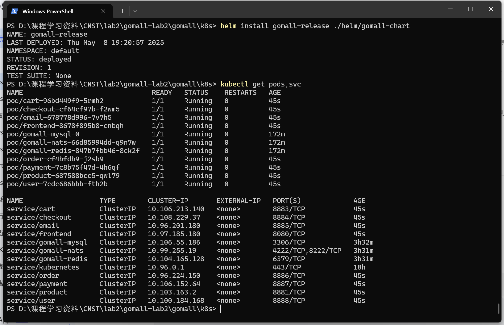

# 一.实验步骤
## 1.安装helm并配置环境变量
## 2.初始化chart目录结构
在`goma11/k8s/helm`目录下执行：
   ```bash
   helm create gomall-chart
   ```
 删除`templates`目录下的默认文件（如`deployment.yaml`、`service.yaml`等）
## 3.配置values.yaml文件，并参数化任务三中的yaml文件
需要将所有的 `*-deployment.yaml` 和 `*-configmap.yaml` 文件进行参数化，例如：  
**任务三的原yaml代码部分：**
```yaml
kitex:
      service: "cart"
      address: ":8883"
      metrics_port: ":9993"
      log_level: info
      log_file_name: "log/kitex.log"
      log_max_size: 10
      log_max_age: 3
      log_max_backups: 50
```
**参数化后的yaml代码：**      
```yaml
kitex:
      service: "{{ .Values.services.cart.name }}"
      address: ":{{ .Values.services.cart.port }}"
      metrics_port: ":{{ .Values.services.cart.metricsPort }}"
      log_level: {{ .Values.services.cart.logConfig.level | quote }}
      log_file_name: {{ .Values.services.cart.logConfig.fileName | quote }}
      log_max_size: {{ .Values.services.cart.logConfig.maxSize }}
      log_max_age: {{ .Values.services.cart.logConfig.maxAge }}
      log_max_backups: {{ .Values.services.cart.logConfig.backups }}
```
**同时values.yaml需要更新配置：**
```yaml
cart:
    name: cart
    port: 8883                   
    metricsPort: 9993
    logConfig:
      level: info
      fileName: "log/kitex.log"
      maxSize: 10
      maxAge: 3
      backups: 50
```      
## 4.调试并运行
首先使用任务二中的yaml文件部署中间件，然后通过  
```bash
helm template gomall-chart --debug
```
确保生成的YAML文件无错误,之后通过
```bash
   helm install gomall-release ./gomall-chart
```
安装chart，随后检查Pod和Service状态：
   ```bash
   kubectl get pods,svc
   ```

# 二、实验结果
